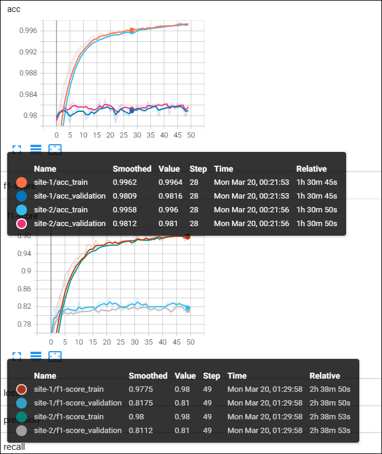

# federated-multi-modality-learning

## Quick Start

## Installation
___
### Pull Git Repo

```bash
git clone git@github.com:PL97/federated-multi-modality-learning.git

cd federated-multi-modality-learning
```

### Pull Docker Image 
```bash
docker pull pytorch/pytorch:1.12.0-cuda11.3-cudnn8-runtime
```
run docker image inside of a container
```bash
export dockerImage=pytorch/pytorch:1.12.0-cuda11.3-cudnn8-runtime

docker run -it --rm --shm-size=1G --gpus '"device=0"' \
--ulimit memlock=-1 --ulimit stack=67108864 --ipc=host --net=host\
    --mount type=bind,source=[PATH_TO_YOUR_DATA] \
--mount type=bind,source=[PATH_TO_CODE],target=/workspace/src \
$dockerImage /bin/bash
```

### Setup Nvflare Environment
```bash
## install NVDlare in a virtual environment
sudo apt update
sudo apt-get install python3-venv

source nvflare-env/bin/activate || python -m venv nvflare-env && source nvflare-env/bin/activate 

python3 -m pip install -U pip
python3 -m pip install -U setuptools

python3 -m pip install nvflare==2.2.1
python3 -m pip install tensorboard
python3 -m pip install torch torchvision transformers
python3 -m pip install pandas
python3 -m pip install seqeval
```
**Now you are ready to run the scripts!**
Simply run 
```bash
sudo chmod +x simulate.sh
./simulate.sh
```

## NER using FedAvg with NVFlare
___


### 2018 Track 2 ADE and medication extraction challenge
download the data here :point_right: [:link:](https://www.kaggle.com/datasets/rajnathpatel/ner-data). processed data can be found here :point_right: [:link:](https://drive.google.com/drive/folders/17IoViGyrczEvgQrFcx_e96Cl9108_bq2?usp=share_link)

python3 -m pip install nvflare==2.2.1
python3 -m pip install tensorboard
python3 -m pip install torch torchvision transformers
python3 -m pip install pandas
python3 -m pip install seqeval
```
**Now you are ready to run the scripts!**
Simply run 
```bash
sudo chmod +x simulate.sh
./simulate.sh
```

## NER using FedAvg with NVFlare
___
### Model
We use bert-base-uncase in this example, download the model :point_right: [:link:](https://huggingface.co/bert-base-uncased)

*In BERT uncased, the text has been lowercased before WordPiece tokenization step while in BERT cased, the text is same as the input text (no changes).*


### 2018 Track 2 ADE and medication extraction challenge
download the data here :point_right: [:link:](https://www.kaggle.com/datasets/rajnathpatel/ner-data). processed data can be found here :point_right: [:link:](https://drive.google.com/drive/folders/17IoViGyrczEvgQrFcx_e96Cl9108_bq2?usp=share_link)

___
### Model
We use bert-base-uncase in this example, download the model :point_right: [:link:](https://huggingface.co/bert-base-uncased)

*In BERT uncased, the text has been lowercased before WordPiece tokenization step while in BERT cased, the text is same as the input text (no changes).*


___
### Evaluation Metric
adapted from [seqeval](https://github.com/chakki-works/seqeval)

:warning: seqeval supports the two evaluation modes. You can specify the following mode to each metrics: **default**, **strict** :warning:

***precision***
```math
precision = \frac{TP}{TP + FP}
```

***recall***
```math
recall=\frac{TP}{TP + FN}
```

***f1-score***

```math
F_1 = \frac{2 precision\times recall}{precision + recall}
```

***micro average***

average samples (e.g. accuracy) to maximize the number of correct predictions the classifier makes

***macro average***

average the metric (e.g. balanced accuracy) <span style="color:green">suggests</span> 

***weighted average***

each classes’s contribution to the average is weighted by its size, lies in between micro and maroc average


___


### Experiment Setup

- algorithm: fedavg
- random splits into two clients
    > client 1: train size 27408, val size 3046
    > 
    > client 2: train size 27409, val size 3046
- learning rate $5\times10^{-5}$
- batch size 32
- epoches 50 (set larger as fedavg coverge slower than pooled training)
- aggregation weights: uniform (1:1)

___
### FedAvg



## Acknowledgment
This work was supported by Cisco Research. We acknowledge the Minnesota
Supercomputing Institute (MSI) at the University of Minnesota for providing resources that contributed to the results. We also thank Dr. Rui Zhang and his student Sicheng Zhou for providing medical data resource and discussion. 

## How to cite this work
___

If you find this gitrepo useful, please consider citing it using the snippet below:
```bibtex
@misc{lePeng2022nvflare-nlp,
    author={Le Peng},
    title={{an Implementation of Federated Learing in NLP using NVFlare}},
    howpublished={\url{https://github.com/PL97/federated-multi-modality-learning}},
    year={2022}
}