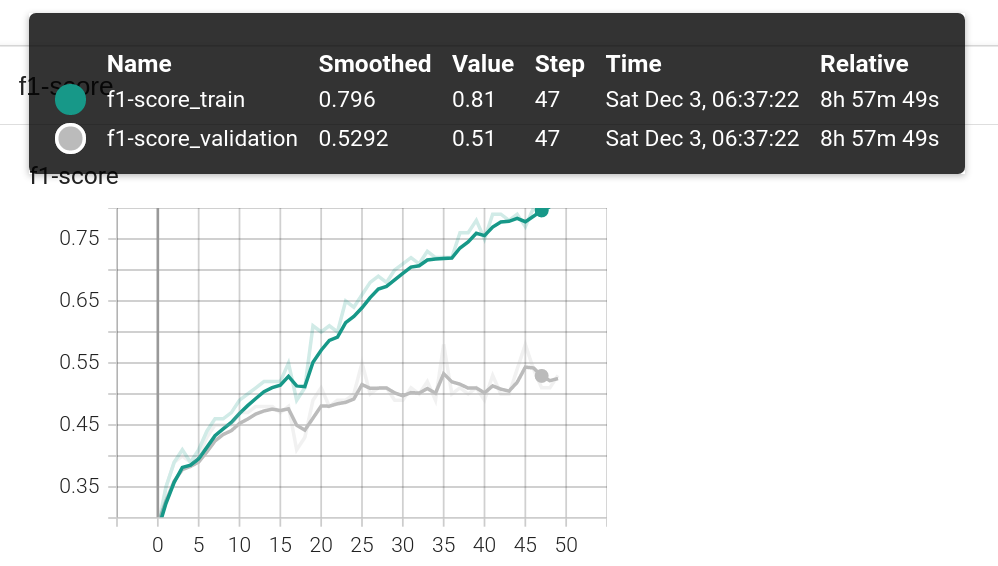
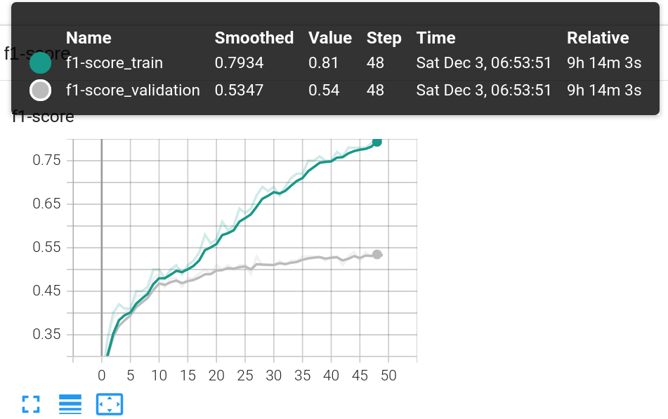
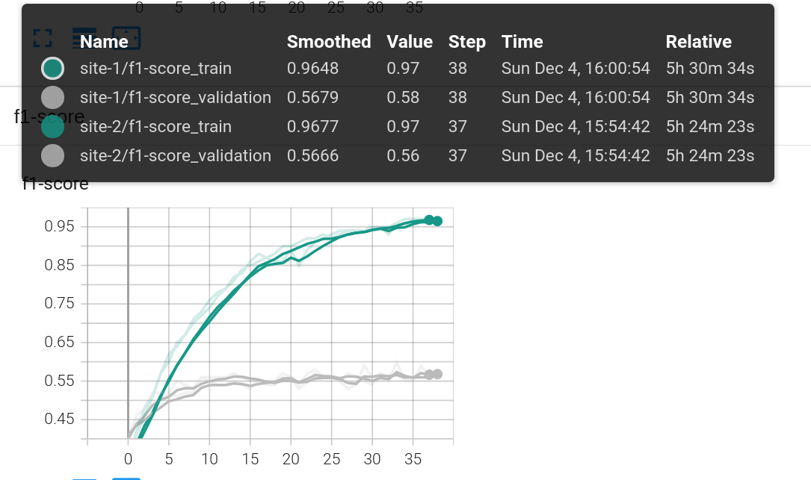

# federated-multi-modality-learning

## Quick Start

## Installation
___
### Pull Git Repo
```bash
git clone git@github.com:PL97/federated-multi-modality-learning.git
```

### Pull Docker Image 
```bash
docker pull pytorch/pytorch:1.12.0-cuda11.3-cudnn8-runtime
```
run docker image inside of a container
```bash
export dockerImage=pytorch/pytorch:1.12.0-cuda11.3-cudnn8-runtime

docker run -it --rm --shm-size=1G --gpus '"device=0"' \
--ulimit memlock=-1 --ulimit stack=67108864 --ipc=host --net=host\
    --mount type=bind,source=[PATH_TO_YOUR_DATA] \
--mount type=bind,source=[PATH_TO_CODE],target=/workspace/src \
$dockerImage /bin/bash
```

### Setup Nvflare Environment
```bash
## install NVDlare in a virtual environment
sudo apt update
sudo apt-get install python3-venv

source nvflare-env/bin/activate || python -m venv nvflare-env && source nvflare-env/bin/activate 

python3 -m pip install -U pip
python3 -m pip install -U setuptools

python3 -m pip install nvflare==2.2.1
python3 -m pip install tensorboard
python3 -m pip install torch torchvision transformers
python3 -m pip install pandas
python3 -m pip install seqeval
```
**Now you are ready to run the scripts!**


## NER using FedAvg with NVFlare
___


### 2018 Track 2 ADE and medication extraction challenge
download the data here :point_right: [:link:](https://www.kaggle.com/datasets/rajnathpatel/ner-data)


| Entity | Description| Count (B) | Count (I) |
| ------| :-----------:| :----: | :---: |
|    geo | geographical entity| 37644 |7414 |
|    org | organization entity| 20143 | 16784|
|    per | person entity|16990 |17251 |
|    gpe | geopolitical entity|15870 | 198|
|    tim | time indicator entity| 20333| 6528|
|    art | artifact entity| 402| 297|
|    eve | event entity| 308| 253|
|    nat | natural phenomenon entity|201 |51 |
|    O | assigned if a word doesn’t belong to any entity.| 887908| |

___
### Model
We use bert-base-uncase in this example, download the model :point_right: [:link:](https://huggingface.co/bert-base-uncased)

*In BERT uncased, the text has been lowercased before WordPiece tokenization step while in BERT cased, the text is same as the input text (no changes).*


___

### Evaluation Metric
adapted from [seqeval](https://github.com/chakki-works/seqeval)

:warning: seqeval supports the two evaluation modes. You can specify the following mode to each metrics: **default**, **strict** :warning:

***precision***
```math
precision = \frac{TP}{TP + FP}
```

***recall***
```math
recall=\frac{TP}{TP + FN}
```

***f1-score***

```math
F_1 = \frac{2 precision\times recall}{precision + recall}
```

***micro average***

average samples (e.g. accuracy) to maximize the number of correct predictions the classifier makes

***macro average***

average the metric (e.g. balanced accuracy) <span style="color:green">suggests</span> 

***weighted average***

each classes’s contribution to the average is weighted by its size, lies in between micro and maroc average


___


### Experiment Setup

- algorithm: fedavg
- random splits into two clients
    > client 1: train size 15346, val size 1918
    > 
    > client 2: train size 15347, val size 1918
- learning rate $5\times10^{-3}$
- batch size 8
- epoches 20 (set larger as fedavg coverge slower than pooled training)
- aggregation weights: uniform (1:1)

single client learning as a baseline
___

### Results
### site 1
**test performance**

|   entity      | precision | recall | f1-score | support |
|--------------|------------|---------|----------|---------|
|         art  |     0.06   |   0.05  |    0.06  |      19 |
|         eve  |     0.11   |   0.06  |    0.08  |      16 |
|         geo  |     0.79   |   0.84  |    0.82  |    1819 |
|         gpe  |     0.91   |   0.92  |    0.92  |     731 |
|         nat  |     0.33   |   0.17  |    0.22  |       6 |
|         org  |     0.65   |   0.63  |    0.64  |     991 |
|         per  |     0.70   |   0.77  |    0.73  |     907 |
|         tim  |     0.79   |   0.80  |    0.79  |     854 |
|   micro avg  |     0.76   |   0.79  |    0.78  |    5343 |
|   macro avg  |     0.54   |   0.53  |    0.53  |    5343 |
|weighted avg  |     0.76   |   0.79  |    0.77  |    5343 |



### site 2
**test performance**

|   entity      | precision | recall | f1-score | support |
|--------------|------------|---------|----------|---------|
|         art  |     0.27   |   0.07  |    0.11  |      45 |
|         eve  |     0.17   |   0.15  |    0.16  |      13 |
|         geo  |     0.81   |   0.87  |    0.84  |    1773 |
|         gpe  |     0.90   |   0.90  |    0.90  |     640 |
|         nat  |     0.00   |   0.00  |    0.00  |      12 |
|         org  |     0.69   |   0.65  |    0.67  |    1045 |
|         per  |     0.75   |   0.73  |    0.74  |     940 |
|         tim  |     0.82   |   0.81  |    0.81  |     859 |
|   micro avg  |     0.79   |   0.79  |    0.79  |    5327 |
|   macro avg  |     0.55   |   0.52  |    0.53  |    5327 |
|weighted avg  |     0.78   |   0.79  |    0.78  |    5327 |




___
### FedAvg


***site1***
|   entity      | precision | recall | f1-score | support |
|--------------|------------|---------|----------|---------|
|         art  |     0.30   |   0.16  |    0.21  |      19 |
|         eve  |     0.50   |   0.19  |    0.27  |      16 |
|         geo  |     0.84   |   0.85  |    0.84  |    1819 |
|         gpe  |     0.93   |   0.94  |    0.94  |     731 |
|         nat  |     0.00   |   0.00  |    0.00  |       6 |
|         org  |     0.69   |   0.65  |    0.67  |     991 |
|         per  |     0.72   |   0.79  |    0.76  |     907 |
|         tim  |     0.84   |   0.80  |    0.82  |     854 |
|   micro avg  |     0.80   |   0.80  |    0.80  |    5343 |
|   macro avg  |     0.60   |   0.55  |    0.56  |    5343 |
|weighted avg  |     0.80   |   0.80  |    0.80  |    5343 |

***site2***

|   entity      | precision | recall | f1-score | support |
|--------------|------------|---------|----------|---------|
|         art  |     0.63   |   0.27  |    0.38  |      45 | 
|         eve  |     0.30   |   0.23  |    0.26  |      13 | 
|         geo  |     0.84   |   0.87  |    0.86  |    1773 | 
|         gpe  |     0.93   |   0.93  |    0.93  |     640 | 
|         nat  |     0.00   |   0.00  |    0.00  |      12 | 
|         org  |     0.70   |   0.69  |    0.69  |    1045 | 
|         per  |     0.74   |   0.76  |    0.75  |     940 | 
|         tim  |     0.84   |   0.82  |    0.83  |     859 | 
|   micro avg  |     0.80   |   0.80  |    0.80  |    5327 | 
|   macro avg  |     0.62   |   0.57  |    0.59  |    5327 | 
|weighted avg  |     0.80   |   0.80  |    0.80  |    5327 | 





## How to cite this work
___

If you find this gitrepo useful, please consider citing it using the snippet below:
```bibtex
@misc{lePeng2022nvflare-nlp,
    author={Le Peng},
    title={{NVFlare-NLP: an Implementation of Federated Learing in NLP using NVFlare}},
    howpublished={\url{https://github.com/PL97/federated-multi-modality-learning}},
    year={2022}
}